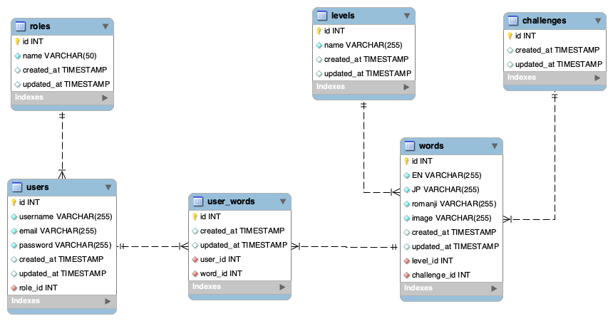

# TAPS - Language Learning Program

This is the FINAL PROJECT of the Full Stack Development Bootcamp with <a href="https://github.com/GeeksHubsAcademy" target="_blank">Geekshubs Academy</a>.


<hr/>

<div align="center">
    
    
    
    
    
    
</div>


<hr/>

<details>
  <summary>Table of Contents</summary>
  <ol>
    <li><a href="#idea-overview">Idea</a></li>
    <li><a href="#general-features">Features</a></li>
    <li><a href="#database-diagram-mysql">Database diagram</a></li>
    <li><a href="#instalation-local">Instalation</a></li>
    <li><a href="#all-routes">Endpoints / Pages</a></li>
    <li><a href="#project-ideation--analysis">Project ideation & analysis</a></li>
    <li><a href="#project-execution">Project execution</a></li>
    <li><a href="#deployment">Deployment</a></li>
    <li><a href="#author">Author / Contact </a></li>
  </ol>
</details>

<hr/>


## Idea overview
This is a language learning program (mobile first) designed to help users learn and practice Japanese vocabulary in an enjoyable and engaging way. 
The program provides various types of word quizzes, pictogram and word recognition, and progress tracking to enhance the learning experience. It gives instant feedback on your progress.

## How the game works

#### Stay Motivated
Easily form a language learning habit with the game-based features and enjoyable challenges with perfect level and pace for you.

#### Effective and Fun Learning Games
With Taps, learning becomes playtime. Engaging games, review modes, and interactive challenges transform language acquisition into a joyful experience.

#### Memorable Illustrations
Boost your memory retention with our captivating visuals and vibrant and soothing colors. Each word is accompanied by an eye-catching image, forging strong associations between the word and its meaning. Say hello to seamless language recall!
  

  <div style="display: flex;">
  <div style="flex: 35%; padding: 0 10px;">


</div>
  <div style="flex: 35%; padding: 0 auto; margin: 0 auto;">


  </div>
</div>


## General features

- Word Quizzes: Users can take quizzes to test their knowledge of vocabulary words.
- Flashcards: Flashcards are available to help users memorize vocabulary.
- Progress Tracking: The program tracks user progress to monitor learning achievements.
- Admin Panel: Administrators can manage users, words and levels in the program.


## Mini-games:
- Learning: the word and symbol appear (tap to continue).
- Compare 2 words (only one matches the symbol).
- Compare 2 symbols (only one matches the word).
- Compare 4 words (only one matches the symbol).
- Compare 4 symbols (only one matches the words).
- Display word AND symbol (is it true or false?).


## Project MVP (just for the Front-end part)
- Use of REDUX
- Complex project structure: Hooks, Components, Services
- Modularized CSS (separated files)
- SPA (use of react-router-dom)
- Register / Login / Editable Profile views
- Views tha consum all endpoints from backend (at least 2 full CRUDs)


## Database diagram (MySQL)
<div align="center">


</div>

## Instalation (local)
1.  Clone this repository: 
`$ git clone https://github.com/SergioTorresGarcia/TAPS_frontend_language-learning-app.git`
2.  Navigate to the project directory `$ cd project-name`
3.  Install dependencies: run ` $ npm i ` in terminal
4.  Connect repository with database 
Set up environment variables: create a .env file in the root directory (sample provided).
5.  Create database in MySQL
    ```sql

    CREATE DATABASE TAPS;

    ```
6.  Run migrations to create tables from the entities:  ` $ npm run migrations `
7.  Run seeders to populate the database:  ` $ npm run seed `
8.  Start server:  ` $ npm run dev `
9.  You can check that connection was stablished successfully:
` http://localhost:4500/healthy ` (either in your browser or in an API Client (i.e. Thunder Client or Postman))

10. If the connection is good, You can check out all the endpoints bellow.
    
<br/>

<details>

<summary>⚠️ To do so, you have 3 options (see here)</summary>

1. Register/login yourself and start playing.

2. Sign in as 'user' and play for a while. Remember to check out the rules of the game, your progress, and try deleting your profiles if you wish:

    ```bash
    {
        "email": "user@mail.com",
        "password": "Aa123456"
    }
    ```

3. Signing in as 'admin' you'd have access to extra functionalities in the admin panel:
    - Roles CRUD
    - Users CRUD
    - Levels CRUD
    - Words CRUD

    ```bash
    {
        "email": "admin@mail.com",
        "password": "Aa123456"
    }
    ```
</details>

## All ROUTES:

<details>
<summary>Auth routes:</summary>

```ts

- register
post http://localhost:4500/auth/register"

- login
post http://localhost:4500/auth/login"
```
</details>

<details>
<summary>User routes:</summary>

```ts
// Endpoints for the users:
- getProfile
get http://localhost:4500/users/me"

- updateSelfProfile
put http://localhost:4500/users/me"

- deleteSelfProfile
delete http://localhost:4500/users/me"

// Endpoints for the admin:
- getUsers
get http://localhost:4500/users"

- getUserById
get http://localhost:4500/users/:id"

- deleteUserById
delete http://localhost:4500/users/:id"
```
</details>

<details>
<summary>Role routes:</summary>


```ts

- getRoles
get http://localhost:4500/roles"

- createRole
post http://localhost:4500/roles"

- updateRole
put http://localhost:4500/roles/:id"

- deleteRole
delete http://localhost:4500/roles/:id"
```

</details>

<details>
<summary>Level routes:</summary>


```ts

- getLevels
get http://localhost:4500/levels"

- createNewLevel
post http://localhost:4500/levels/new"
```

</details>

<details>
<summary>Word routes:</summary>


```ts

- getWords
get http://localhost:4500/words"

- getOneWord
get http://localhost:4500/words/first"

- createNewWord
post http://localhost:4500/words/new"

- getWordToPlay
get http://localhost:4500/words/current"

- getWordsLearnt
get http://localhost:4500/words/learnt"

- getWordById
get http://localhost:4500/words/:id"

- updateWord
put http://localhost:4500/words/:id"

- deleteWord
delete http://localhost:4500/words/:id"

- getWordsFromLevel
get http://localhost:4500/words/level/:level_id"

- getWordsFromLevelToDivert
get http://localhost:4500/words/level/diversion/:level_id"
```
</details>

<details>
<summary>UserWord routes:</summary>


```ts

- getLearntWords
get http://localhost:4500/words/learnt"

- getWordToDivert
get http://localhost:4500/words/divert"

- setUpWordAsLearnt
post http://localhost:4500/words/add-to-learnt"
```
</details>


## Project Ideation & Analysis:
DTP - Design Thinking Proces through sketching, prototyping, brainstorming, try/error.

```sql

(...)un desarrollador que antes de lanzarse a programar
piensa a fondo en sus necesidad y crea un diseño, 
luego hace cosas mucho más sólidas, fáciles de mantener y escalables.

-- Demian Ortizlanzas --

```

<details>
<summary>Here is a taste of that</summary>

#### User Stories:
1.- Who am I? <br/>
2.- what do I wanna do?<br/>
3.- what for?<br/>
<div align="center">


<p>Work organization</p>
<div float:"left">


</div>

<p>Different DATABASE structure</p>
<div float:"left">




</div>

</div>
</details>


## Project Execution:
<details>
  <summary>1. SQL - Database design:</summary>
    
-   Analyze the task to find the purpose of the database and gather all requirements
-   Concept design: create an Entity-Relationship Diagram where we define tables, their attributes, and the relationships with one another.
-   Normalization: eliminate redundancy, identify primary keys (PK) and foreign keys (FK)
-   Logical thinking: decide what can and cannot be 'NULL' (not required) and which are 'UNIQUE' fields
</details>


<details>
  <summary>2. DOCKER - Creating a container</summary>

-   Install docker
- Create a container
    > docker run -d -p 3306:3306 --name <container-name> -e MYSQL_ROOT_PASSWORD=<your_password> mysql
- Access it
    > mysql -h localhost -P 3306 -u root -p
you will need -h (host), -P (port), -u (username) and -p (password)
- Execute it
    > docker exec -it <container-name> bash
</details>

<details>
  <summary>3. EXPRESS - Create a server connection</summary>

- We initiate NODE:  `$ npm init` 
    This creates 'package.json' where all the dependencies will be stored.

- We run the command: `$ npm install express --save`
    This creates 'package-lock.json' and the 'node_modules' folder

- We create the folder '.gitignore' and add '/node_modules' inside
    This blocks the heavy folder from being upload to github with the rest of the project.

- We install TYPESCRIPT (as developers) `$ npm install typescript -D`

- We create the 'tsconfig.json' file: `$ npx tsc --init`

- We install types /express & node: `$ npm install @types/express @types/node -D`

- We install dependencies to compile TS (nodemon): `$ npm install ts-node nodemon -D`

- We add a shortcut to the package.json's scripts:
    > "dev": "nodemon ./src/server.ts"

- We create the file '.env' with the PORT (of the server) and add '.env' to the '.gitignore'.

    Also add a copy '.env.sample' where we will storage a blueprint of data, without the sensitive information (in this case: 'PORT= ')

- We install 'dotenv': `$ npm i dotenv`
    This gets added to the dependencies and will grab data from the .env file
</details>

<details>
  <summary>4. DOTENV - Connect to the DB</summary>

- We create the folder 'src' with a 'server.ts' file inside.
    The main function connects to the server `startServer();`<br/>
- We link a new file called `app.ts` to separate responsabilities.<br/>
-   In this file we write the following code:

    ```js
    import express from "express";
    import dotenv from "dotenv";
    import { Request, Response } from "express";
    
    // links the .env folder
    dotenv.config(); 

    // runs server connection
    const app = express(); 

    // parses responses to .json)
    app.use(express.json()); 

    // sets up the connection port
    const PORT = process.env.PORT || 4500; 

    // server is up and listening to any upcomming request
    app.listen(3000, () => console.log('Servidor levantado en 3000')); 


    // testing request - 'Hello world' means we are ready to go!
    app.get('/', (req: Request, res: Response) => {
        res.send('Hello world!')
    }); 
    ```

- We run the server using the previously created nodemon shortcut: `$ npm run dev`
</details>

<details>
  <summary>5. MySQL Workbench</summary>

- We open the workbench and run the following commands:

    ```sql
    CREATE DATABASE <project_name>;
    USE <project_name>;
    ```
</details>

<details>
  <summary>6. MIGRATIONS & MODELS</summary>

- Creating MIGRATIONS [Data Definition Language (DDL): with typeorm]: `./src/database/migrations`
- Adding them to `DataSource.migrations` in the `db.ts` file
- Creating MODELS (entities) [Data Manipulation Language (DML)]
- Adding them to `DataSource.entities` in the `db.ts` file
</details>

<details>
  <summary>7. CONTROLLERS</summary>

- We create controllers (in a folder on the same level with `package.json`)
</details>

<details>
  <summary>8. ROUTES</summary>

- We create routes (in `app.ts`) for all entities:
`app.use('/', roleRouter)`
- We create a folder colled `routes` where we add separate files for storing the routes of the different entities - for CRUD (create, read, update and delete) database records. For instance: `authRouter.post("/auth/register", register)`
</details>

<details>
  <summary>9. MIDDLEWARE: auth()</summary>
  
  - Additionally we need to control access to our data. We will use 'middleware' functions.

  -  `Auth` (authorisation systembased on TOKENs) will block anything that is not to be seen by the general public. In our case, it only does not affect to `register` and `login` (as those are the endpoints reachable without logging in)
  -  The `auth()` function verifies an encrypted TOKEN created automatically while logging in. With an active token we have access to other data.
</details>

<details>
  <summary>10. MIDDLEWARE: isAdmin()</summary>
  
- We also want to grant special administrative access. With another middleware, the `isAdmin()` function, we control PERMISSIONS.
- The 'admin' role would be able to reach all users data, and admin panel while Users would have a more limited reach. This system provides great security and scalability, and more levels can be implemented in the future.
</details>

<details>
  <summary>11. TOKENDATA</summary>

- For the TOKEN to work, we create a new file `./types/index.d.ts` with the following lines:

    ```js
    export type tokenData = {
        userId: number;
        roleName: string;
    };

    declare global {
        namespace Express {
            export interface Request {
                tokenData: tokenData;
            }
        }
    }
    ```
</details>

<details>
  <summary>12. SEEDERS</summary>

- In order to check out this project, you'll need to ppopulate the database.

- Follow steps 6 and 7 of the <a href="#instalation-local">instalation</a>
</details>


## Deployment

*PENDING DEPLOYMENT*


## Author
<div align="center">
<a href = "mailto:a.sergiotorres@gmail.com">

</a>
<a href="https://github.com/SergioTorresGarcia" target="_blank">

</a> 
<a href="https://www.linkedin.com/in/s-t-g/" target="_blank">

</a> 
</div>
